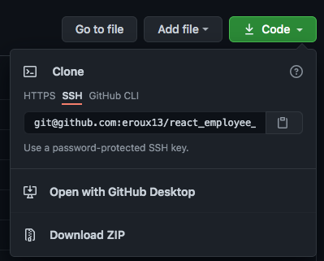
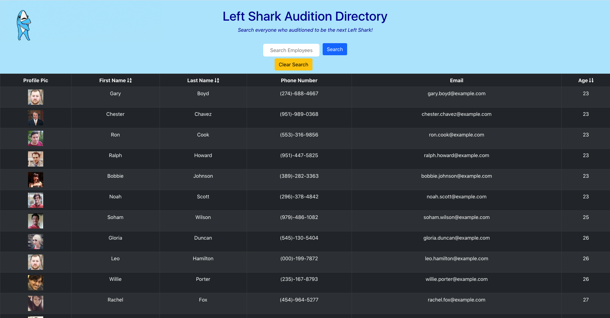

# Left Shark Audition Directory

## Description

This project is essentially an employee directory that is built using [ReactJS](https://reactjs.org/docs/getting-started.html). This application breaks up the UI into several components, then manages the component state, and responds to user events. This project also features the use of [axios](http://www.npmjs.com/package/axios) to make calls to the [RandomUser API](https://randomuser.me/documentation).

Deployed Application:

## Table of Contents

- [Description](#description)
- [License](#license)
- [Installation](#installation)
- [Usage](#usage)
- [Contributors](#contributors)
- [Tests](#tests)
- [Questions](#questions)
- [Screenshot](#screenshot)

## License

License chosen: MIT.
More information about the license chosen can be found on [Open Source Initiative](https://opensource.org/licenses/MIT).

## Installation

To install this project, the user first needs to clone the repo onto their local machine. Once cloned, the user then needs to navigate into the project directory in either Terminal or Git Bash depending on the users OS and run `npm i` to install all the required packages. Upon completion, the user can then start up the application by running `npm run start`.

## Usage

The usage of this project is to allow an employee or manager to view non-sensitive data about other employees. They are also able to sort the directory in alphabetical order using either the first name or last name. They are also able to sort by age from youngest to oldest as well as just search by name in the search bar.

## Contributors

[eroux13](https://www.github.com/eroux13)

## Tests

There are currently no tests for this project.

## Questions

Feel free to follow my GitHub [profile](https://www.github.com/eroux13).
If you have any questions about this project, please reach out to me via ej.roux13@gmail.com.

## Screenshot

